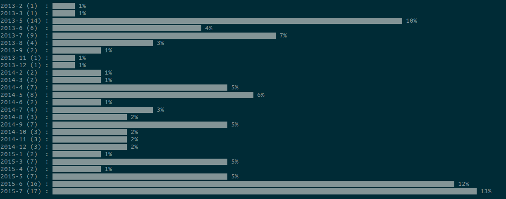

# gh-repos-creation-cal

> Create a calendar of your repository creations in GitHub

[](https://travis-ci.org/icyflame/gh-repos-creation-cal)

[](https://github.com/Flet/semistandard)



## Install

```
$ npm install --save gh-repos-creation-cal
```


## CLI

```
$ npm install --global gh-repos-creation-cal
```
```
$ gh-repos-creation-cal --help

  Usage
    $ gh-repos-creation-cal username

  Examples
    $ gh-repos-creation-cal icyflame --monthly
    //=> Outputs the screenshot

  Options
    --monthly Show the monthly repo-creation numbers.
              Default: true
```


## License

MIT © [Siddharth Kannan](http://icyflame.github.io)
